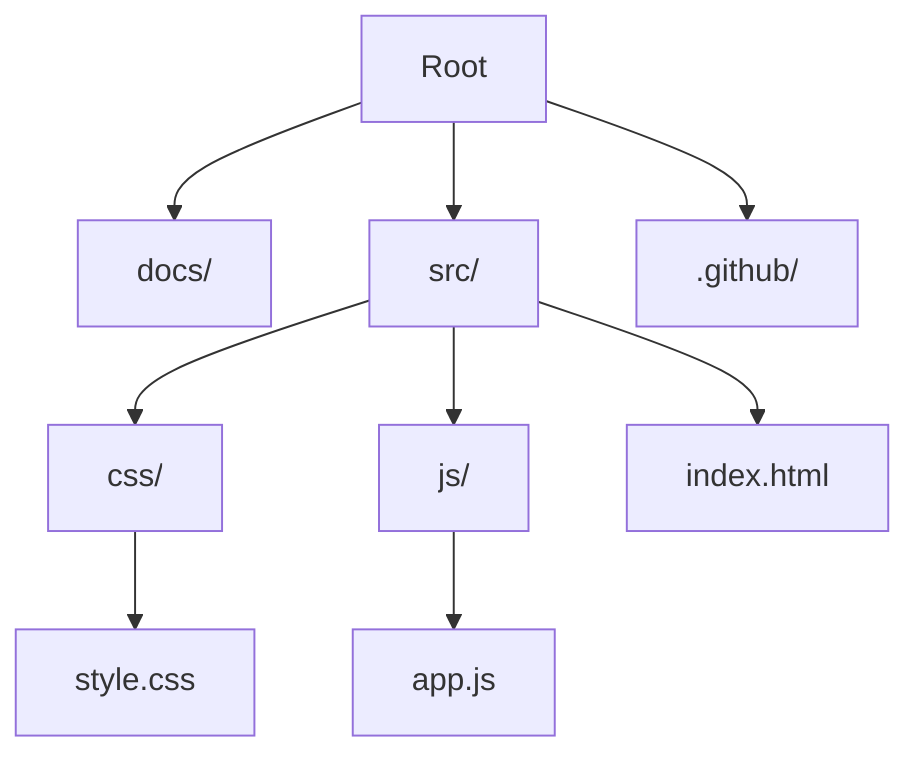

# Architecture Overview

This document describes the high-level architecture of the Vanilla JS Portfolio project.

## Design Philosophy

The project follows a **Separation of Concerns** principle, even within a simple vanilla environment.

- **HTML** (`src/index.html`): Structure and semantics only. No inline styles or scripts.
- **CSS** (`src/css/`): Presentation and layout.
- **JS** (`src/js/`): Behavior and interactivity.

## Directory Structure

## Key Components

### 1. The Core (`src/index.html`)
The entry point. It loads the CSS in the `<head>` and the JS at the end of the `<body>`.

### 2. Styling (`src/css/style.css`)
Uses modern CSS variables (Custom Properties) for theming and Flexbox/Grid for layout.

### 3. Logic (`src/js/app.js`)
Contains the application logic. It uses an IIFE (Immediately Invoked Function Expression) or ES6 Modules to avoid polluting the global namespace.

## Data Flow

Since this is a static portfolio, data flow is minimal. Content is primarily static HTML. However, if dynamic data were added (e.g., fetching GitHub repos), it would follow this flow:

1. `app.js` initiates `fetch` request.
2. API responds with JSON.
3. DOM manipulation functions update the UI.
